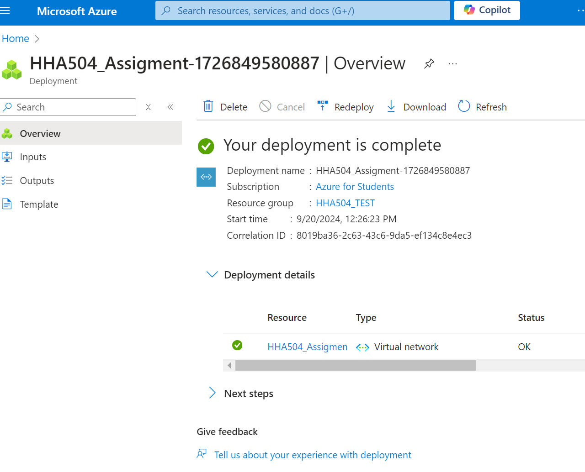

# Networking in Azure and GCP - IPs and Domain Management

### Virtual Private Cloud (VNet) Creation
- Navigated to the Azure portal
- Created a Virtual Network (VNet) with an IP address range and subnet
- Reserved a static public IP for a virtual machine
- Mapped the reserved IP to a domain using Azure DNS

#### Screenshots:

## Google Cloud Platform (GCP)

### Virtual Private Cloud (VPC) Creation
- Accessed Google Cloud Console
- Created a VPC with a similar IP address range and subnet as in Azure
- Reserved a static external IP for a Compute Engine instance
- Mapped the reserved IP to a domain using Google Cloud DNS

### Issues Encountered
Faced issues reserving a static IP and mapping the domain due to permission or account-related issues.

#### Screenshots:

